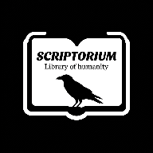

<div align="center">



# Scriptorium

**One offline Android library for the world's sacred texts — Torah, Bible, Quran, Sahih al-Bukhari, Talmud and Bhagavad Gita, side by side.**

[](https://github.com/muhsintags/Stable-Scriptorium/actions/workflows/build.yml)
[](https://github.com/muhsintags/Stable-Scriptorium/releases/latest)
[](https://github.com/muhsintags/Stable-Scriptorium/releases)
[](LICENSE)
[](https://kotlinlang.org)
[](https://developer.android.com/compose)
[](https://github.com/muhsintags/Stable-Scriptorium/stargazers)

[**⬇ Download APK**](https://github.com/muhsintags/Stable-Scriptorium/releases/latest) ·
[Screenshots](#screenshots) ·
[Features](#features) ·
[Tech stack](#tech-stack) ·
[Build](#build--run) ·
[Contributing](#contributing)

</div>

---

## Why Scriptorium?

Most scripture apps cover a single tradition, need a permanent internet connection, or bury the text under accounts, ads and daily-verse popups. Scriptorium does one thing: it gives you **six primary texts from four traditions in one reader**, downloads them once, and then works fully offline — no account, no ads, no tracking. Open two of them next to each other and compare a passage line by line.

> Free and open source (MIT), ~4 MB, no ads, no analytics, no login.

## Screenshots

Coming shortly — drop `library.png`, `reader.png`, `compare.png` and `translate.png` into `docs/screenshots/` and uncomment the table below.

<!--
| Library | Reader | Comparative mode | Translation |
| :---: | :---: | :---: | :---: |
|  |  |  |  |
-->

## Features

| | |
| --- | --- |
| **6 texts included** | Torah, Bible, Quran, Sahih al-Bukhari, Talmud, Bhagavad Gita |
| **Comparative reading** | Two texts side by side in 3 different viewing modes |
| **Works offline** | Each text is downloaded once and stored locally with Room |
| **Built-in translation** | Google Translate integration for cross-language reading |
| **Modern UI** | Jetpack Compose + Material 3, dark-mode friendly |
| **Private by design** | No account, no ads, no analytics, no background network calls |

## Download

| Option | What you get | Where |
| --- | --- | --- |
| **Latest release** | Stable, signed release APK | [Releases](https://github.com/muhsintags/Stable-Scriptorium/releases/latest) |
| **APKPure** | Store install & auto-updates | [apkpure.com/p/com.muhsintags.scriptorium](https://apkpure.com/p/com.muhsintags.scriptorium) |
| **Dev build** | Freshest debug build (may be unstable) | [Actions](https://github.com/muhsintags/Stable-Scriptorium/actions) → latest run → Artifacts |

Requires Android 8.0+ · ~4 MB download · texts are fetched on first open.

## Tech stack

| Layer | Choice |
| --- | --- |
| Language | Kotlin |
| UI | Jetpack Compose (Material 3) |
| Architecture | MVVM |
| Local storage | Room |
| Networking | Retrofit + OkHttp |
| Async | Kotlin Coroutines |
| CI/CD | GitHub Actions |
| Dev environment | GitHub Codespaces |

> Built entirely in the cloud — no local Android Studio setup. Every build, test and release runs through GitHub Actions and Codespaces, from a phone and a browser.

## Build & run

```bash
git clone https://github.com/muhsintags/Stable-Scriptorium.git
cd Stable-Scriptorium
./gradlew assembleDebug      # debug APK
./gradlew assembleRelease    # signed release (needs keystore secrets)
```

Or push to `main` and download `app-debug` / `app-release` from the [Actions](https://github.com/muhsintags/Stable-Scriptorium/actions) run artifacts.

## Project structure

```
Stable-Scriptorium/
├── app/                  # Application module (Compose UI, Room, repositories)
├── gradle/               # Gradle wrapper & version catalog
├── .github/workflows/    # CI/CD build pipeline
├── Versions/             # Archived APK builds
├── index.html            # Landing page (GitHub Pages)
└── privacy.html          # Privacy policy
```

## Roadmap

- [x] APKPure release
- [x] Comparative reading mode (3 viewing modes)
- [x] Firebase dependency cleanup
- [ ] v2.0 — Guru Granth Sahib, Book of Mormon, Buddhist texts (Tripitaka / Sutta)
- [ ] Turkish commentary layer
- [ ] Full-text search across all texts
- [ ] Bookmarks & notes
- [ ] F-Droid / IzzyOnDroid listing
- [ ] Google Play release

Have a different priority? [Open an issue](https://github.com/muhsintags/Stable-Scriptorium/issues/new) and say so.

## Contributing

A solo project, but issues, ideas and pull requests are all welcome. Good first contributions:

- **Translate the UI** into your language — a native speaker beats machine translation
- **Add a text** that isn't in the library yet
- **Extend comparative mode** with new viewing options
- **Fork it into a philosophy library** — Stoics, Confucius, classical works instead of scripture
- **Report a rendering bug** with a screenshot and your device model

## Privacy

Scriptorium collects nothing. No account, no analytics, no ads. Full policy: [muhsintags.github.io/Stable-Scriptorium/privacy.html](https://muhsintags.github.io/Stable-Scriptorium/privacy.html)

## Built with AI assistance

Developed with help from Claude (Anthropic), ChatGPT (OpenAI), Google AI Studio and Gemini.

## License

[MIT](LICENSE) © muhsintags

<div align="center">

If Scriptorium is useful to you, a ⭐ helps other people find it.

</div>
